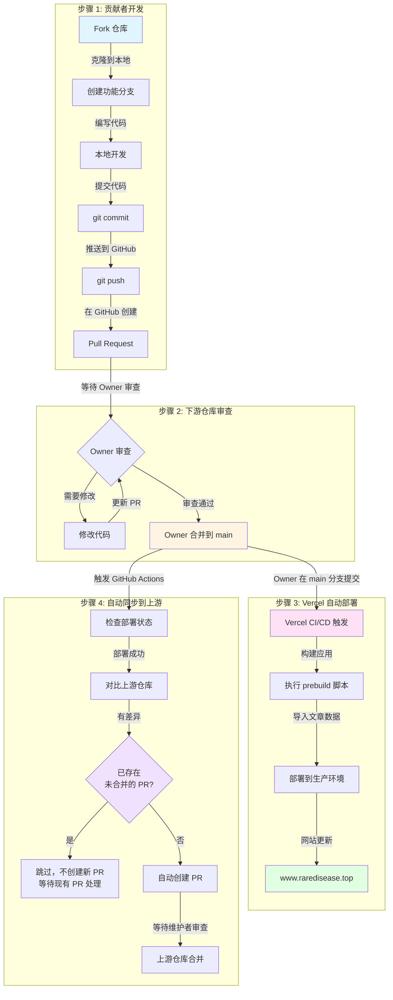

# 贡献指南

感谢你对 Rare Disease Info Platform 项目的关注！我们欢迎所有形式的贡献。

## 🤝 如何贡献

你可以通过以下方式贡献：

- 🐛 **报告 Bug**：在 [Issues](https://github.com/OpenRareDisease/info_platform/issues) 中报告问题
- 💡 **提出功能建议**：在 [Issues](https://github.com/OpenRareDisease/info_platform/issues) 中提出新功能想法
- 📝 **改进文档**：完善 README、代码注释或文档
- 💻 **提交代码**：修复 Bug 或实现新功能
- 🌐 **翻译**：帮助翻译内容或改进多语言支持

## 🚀 开始贡献

### 1. Fork 仓库

1. 访问 [上游仓库](https://github.com/OpenRareDisease/info_platform)
2. 点击右上角的 "Fork" 按钮
3. 等待 fork 完成

### 2. 克隆你的 Fork

```bash
git clone https://github.com/YOUR_USERNAME/info_platform.git
cd info_platform
```

### 3. 添加上游仓库

```bash
git remote add upstream https://github.com/OpenRareDisease/info_platform.git
```

### 4. 创建功能分支

```bash
git checkout -b feat/your-feature-name
# 或
git checkout -b fix/your-bug-fix
```

分支命名规范：

- `feat/` - 新功能
- `fix/` - Bug 修复
- `docs/` - 文档更新
- `refactor/` - 代码重构
- `style/` - 代码格式调整
- `test/` - 测试相关

## 💻 开发环境设置

### 环境要求

- **Node.js** >= 18
- **npm**、**yarn** 或 **pnpm**
- **Python 3.8+**（如果开发 rare_disease_bot 子项目）
- **Git**

### 安装依赖

```bash
# 安装 Node.js 依赖
npm install
# 或
yarn install
# 或
pnpm install --shamefully-hoist
```

### 配置环境变量

创建 `.env` 文件（参考 `.env.example` 如果存在）：

```bash
# Supabase 配置（用于本地开发）
SUPABASE_URL=your_supabase_url
SUPABASE_KEY=your_supabase_anon_key
SUPABASE_SERVICE_KEY=your_supabase_service_key
```

> **注意**：如果你没有 Supabase 账户，可以：
>
> - 使用项目的 Supabase 实例（需要权限）
> - 或者只开发前端功能，不涉及数据库操作

### 运行开发服务器

```bash
npm run dev
```

访问 http://localhost:3000 查看应用。

## 📝 代码规范

### 代码风格

项目使用 **ESLint** 和 **Prettier** 进行代码规范检查。

**Prettier 配置**：

- 不使用分号
- 单引号
- 2 空格缩进
- 100 字符行宽
- ES5 尾随逗号

**ESLint 规则**：

- TypeScript 严格模式
- Vue 3 Composition API 最佳实践
- 警告未使用的变量（`_` 前缀除外）
- 警告显式 `any` 类型

### 运行代码检查

```bash
# 检查代码规范
npm run lint

# 自动修复
npm run lint:fix

# 格式化代码
npm run format

# 检查格式（CI/CD 使用）
npm run format:check
```

### Git Hooks

项目配置了 **Husky**，在提交前会自动：

- 运行 ESLint 检查并自动修复
- 使用 Prettier 格式化代码
- 如果有无法修复的错误，会阻止提交

### 代码提交规范

提交信息遵循 [Conventional Commits](https://www.conventionalcommits.org/) 规范：

```
<type>(<scope>): <subject>

<body>

<footer>
```

**类型（type）**：

- `feat`: 新功能
- `fix`: Bug 修复
- `docs`: 文档更新
- `style`: 代码格式调整（不影响功能）
- `refactor`: 代码重构
- `perf`: 性能优化
- `test`: 测试相关
- `chore`: 构建/工具相关

**示例**：

```bash
git commit -m "feat(ui): 添加文章搜索功能"
git commit -m "fix(api): 修复文章列表分页问题"
git commit -m "docs: 更新 README 中的安装说明"
```

## 🔄 提交 Pull Request

> 💡 **为什么需要这个流程？**
>
> 由于 Vercel 免费版的限制：
>
> - 只能关联个人 private 仓库
> - 只有 repo owner 在 `main` 分支的提交才会触发部署
>
> 因此，我们需要：
>
> 1. 在下游仓库（`demongodYY/info_platform_fork`）开发并提交 PR
> 2. Owner 合并后触发 Vercel 部署
> 3. 自动同步到上游仓库（`OpenRareDisease/info_platform`）

### 1. 保持分支同步

在提交 PR 前，确保你的分支是最新的：

```bash
git checkout main
git pull upstream main
git checkout feat/your-feature-name
git rebase main
# 或
git merge main
```

### 2. 确保代码通过检查

```bash
# 运行 lint 检查
npm run lint

# 运行格式检查
npm run format:check

# 确保没有错误
npm run build
```

### 3. 提交更改

```bash
git add .
git commit -m "feat: 你的功能描述"
git push origin feat/your-feature-name
```

### 4. 创建 Pull Request

> ⚠️ **重要提示**：代码提交并推送到 GitHub 后，**必须创建 Pull Request 并等待 Owner 合并**。
>
> **触发部署的条件**：
>
> - 只有在 [demongodYY/info_platform_fork](https://github.com/demongodYY/info_platform_fork) 仓库的 `main` 分支上
> - **Owner 提交的 merge 或 push** 才会触发 Vercel CI/CD 自动部署
> - 其他贡献者的提交不会触发部署

1. 访问 [下游仓库](https://github.com/demongodYY/info_platform_fork)
2. 点击 "Compare & pull request" 按钮
3. 填写 PR 描述：
   - **标题**：清晰描述你的更改
   - **描述**：
     - 更改的目的和背景
     - 如何测试
     - 相关 Issue（如果有）
     - 截图（如果是 UI 更改）
4. 点击 "Create pull request"
5. **等待 Owner 审查并合并**：只有 Owner 合并 PR 后，才会触发 Vercel CI/CD 自动部署到线上网站

### 5. PR 审查流程

- Owner 会审查你的 PR
- 可能需要根据反馈进行修改
- 审查通过后，Owner 会将 PR 合并到 `main` 分支
- **只有在 `main` 分支上 Owner 的 merge 或 push 才会触发 Vercel CI/CD**，将更新部署到线上网站 [www.raredisease.top](https://www.raredisease.top)

### 6. 完整开发流程图



### 7. 关键注意事项

#### ⚠️ Vercel 部署触发条件

**✅ 会触发部署的情况：**

- Owner (`demongodYY`) 在 `main` 分支上 merge PR
- Owner (`demongodYY`) 直接 push 到 `main` 分支

**❌ 不会触发部署的情况：**

- 贡献者推送代码到自己的分支
- 贡献者创建 PR（未合并前）
- Owner 在其他分支上的提交
- 其他贡献者合并 PR（如果被授予权限）

#### 📋 完整流程检查清单

- [ ] Fork 了 [下游仓库](https://github.com/demongodYY/info_platform_fork)
- [ ] 创建了功能分支（如 `feat/your-feature`）
- [ ] 完成了代码开发
- [ ] 运行了 `npm run lint` 和 `npm run format:check`
- [ ] 提交了代码并推送到 GitHub
- [ ] 在 GitHub 上创建了 Pull Request
- [ ] 等待 Owner 审查并合并 PR
- [ ] Owner 合并后，Vercel 会自动部署（无需手动操作）
- [ ] GitHub Actions 会自动同步到上游仓库（无需手动操作）

## 🏗️ 项目结构

```
.
├── pages/                    # Nuxt 页面路由
│   ├── index.vue            # 文章列表页
│   └── notes/               # 文章相关页面
│       ├── [id].vue         # 文章详情页
│       └── edit.vue         # 文章编辑页
├── server/                  # 服务端代码
│   ├── api/                 # API 路由
│   │   └── notes/           # 文章相关 API
│   ├── articles/            # 爬虫生成的文章（Markdown）
│   ├── plugins/             # 服务端插件
│   └── scripts/             # 构建脚本
│       └── import-articles.js  # 文章导入脚本
├── rare_disease_bot/        # 智能新闻爬虫子项目
│   ├── config/              # 配置文件
│   ├── core/                # 核心功能模块
│   ├── utils/               # 工具函数
│   └── main.py              # 爬虫入口
├── types/                   # TypeScript 类型定义
├── .github/workflows/       # GitHub Actions workflows
└── nuxt.config.ts          # Nuxt 配置
```

## 🧪 测试

### 运行开发服务器

```bash
npm run dev
```

访问 http://localhost:3000 并手动测试你的更改。

### 构建测试

```bash
# 构建生产版本
npm run build

# 预览生产构建
npm run preview
```

## 📚 开发 rare_disease_bot 子项目

如果你要贡献 `rare_disease_bot` 子项目：

1. **进入子项目目录**：

   ```bash
   cd rare_disease_bot
   ```

2. **创建虚拟环境**：

   ```bash
   python3 -m venv venv
   source venv/bin/activate  # Windows: venv\Scripts\activate
   ```

3. **安装依赖**：

   ```bash
   pip install -r requirements.txt
   playwright install chromium
   ```

4. **配置环境变量**：
   创建 `rare_disease_bot/.env` 文件

5. **运行测试**：
   ```bash
   python main.py --url https://rarediseases.org/news/ --max-articles 1
   ```

详细说明请参考 [rare_disease_bot/README.md](./rare_disease_bot/README.md)

## ❓ 常见问题

### Q: 我没有 Supabase 账户，可以开发吗？

A: 可以！你可以：

- 只开发前端功能（不涉及数据库操作）
- 使用 Mock 数据
- 申请访问项目的 Supabase 实例（联系 maintainer）

### Q: 如何测试 API 路由？

A: 你可以：

- 使用 Nuxt DevTools（开发模式下自动启用）
- 使用 `curl` 或 Postman 测试 API
- 查看 `server/api/` 目录下的 API 实现

### Q: 提交 PR 后需要做什么？

A:

- 等待 Owner 审查
- 根据反馈进行修改
- 保持 PR 分支与上游 main 分支同步
- **等待 Owner 合并 PR**：只有 PR 被合并到主分支后，才会触发 Vercel CI/CD 自动部署到线上网站

### Q: 为什么我推送了代码但网站没有更新？

A:

**重要**：代码推送到 GitHub 后，**必须创建 Pull Request 并等待 Owner 合并到 `main` 分支**，才会触发 CI/CD 部署。

**触发部署的条件**：

- 只有在 [demongodYY/info_platform_fork](https://github.com/demongodYY/info_platform_fork) 仓库的 `main` 分支上
- **Owner 提交的 merge 或 push** 才会触发 Vercel CI/CD 自动部署
- 其他贡献者的提交不会触发部署

**完整流程**：

```
贡献者推送代码到分支
    ↓
创建 Pull Request（这一步很重要！）
    ↓
等待 Owner 审查
    ↓
Owner 合并 PR 到 main 分支 ← 只有这里才会触发部署
    ↓
Vercel CI/CD 自动部署
    ↓
网站更新：www.raredisease.top
```

**常见误解**：

- ❌ 推送代码到分支就会触发部署 → **错误**，需要创建 PR 并等待 Owner 合并
- ❌ 创建 PR 就会触发部署 → **错误**，需要 Owner 合并到 `main` 分支
- ✅ Owner 合并 PR 到 `main` 分支 → **正确**，这会触发部署

这是 Vercel 免费版的限制：只有 repo owner 在 `main` 分支上的提交才会触发部署。

### Q: 我需要手动同步到上游仓库吗？

A: **不需要！** GitHub Actions 会自动处理：

1. Owner 合并 PR 到 `main` 分支后
2. GitHub Actions workflow 会自动：
   - 等待 Vercel 部署完成（最多等待 10 分钟）
   - 检查代码变更（对比上游仓库）
   - 自动创建 PR 到上游仓库 [OpenRareDisease/info_platform](https://github.com/OpenRareDisease/info_platform)
3. 你只需要等待上游仓库维护者审查并合并即可

**完全自动化，无需手动操作！** 🎉

### Q: 如何报告 Bug？

A: 在 [Issues](https://github.com/OpenRareDisease/info_platform/issues) 中创建新 issue，包含：

- Bug 描述
- 复现步骤
- 预期行为
- 实际行为
- 环境信息（浏览器、Node.js 版本等）
- 截图（如果有）

### Q: 如何提出新功能建议？

A: 在 [Issues](https://github.com/OpenRareDisease/info_platform/issues) 中创建新 issue，描述：

- 功能需求
- 使用场景
- 可能的实现方案（可选）

## 📖 相关资源

- [Nuxt 3 文档](https://nuxt.com/docs)
- [Vue 3 文档](https://vuejs.org/)
- [TypeScript 文档](https://www.typescriptlang.org/)
- [Supabase 文档](https://supabase.com/docs)
- [ESLint 文档](https://eslint.org/)
- [Prettier 文档](https://prettier.io/)

## 🙏 致谢

感谢所有贡献者的支持！你的贡献让这个项目变得更好。

---

如有任何问题，欢迎在 [Issues](https://github.com/OpenRareDisease/info_platform/issues) 中提问。
